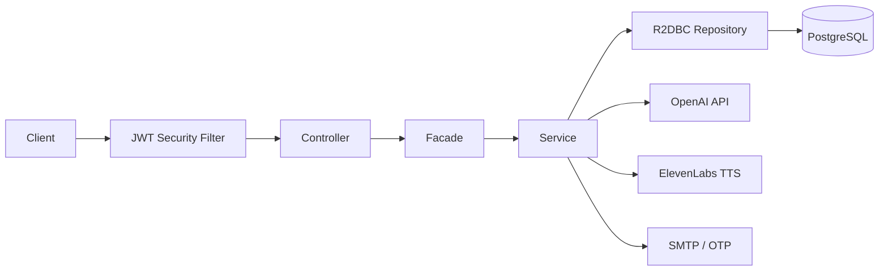

# ORD API

**AI-powered language-learning backend — fully reactive Kotlin / Spring WebFlux.**

ORD is the backend for a vocabulary-learning app where users capture words, practice through AI-generated games and conversations, and get on-demand explanations — all scoped to their CEFR proficiency level. Built as a personal learning project, it follows production-grade patterns: strict layering, a first-class OpenAPI contract, and full controller integration test coverage.


## Highlights

- **Fully non-blocking stack** — Spring WebFlux + R2DBC end-to-end; SSE streaming for AI responses
- **OTP → JWT auth** — email one-time codes, JWT delivered via HTTP-only cookie; reactive Spring Security
- **AI-native features** — OpenAI for generation, review, and structured outputs; ElevenLabs for TTS; per-operation GPT token-usage logging
- **Strict layered architecture** — `Controller → Facade → Service → Repository → Entity / Mapper / DTO` with vertical feature slicing
- **Contract-first API** — SpringDoc OpenAPI spec exported to `openapi.json`; TypeScript types auto-published on change
- **Integration-tested** — 15+ controller test suites via Kotest + Testcontainers (PostgreSQL)

## Features

| Domain | What it does |
|--------|-------------|
| **Conversations** | Scenario-based AI chat with customizable interlocutors, per-message analysis, and learning tips |
| **Games** | AI-generated practice: crossword, sentence writing, words typing — with AI review |
| **Quickly Added Words** | Fast vocabulary capture flow, including a public anonymous entry point |
| **AI Explainer** | On-demand phrase explanations |
| **TTS** | Text-to-speech via ElevenLabs |
| **Words & details** | Vocabulary CRUD with AI-generated definitions, examples, and manual enrichment |
| **Language proficiencies** | Per-user CEFR levels (A1–C2) gating generative features |
| **Banks & groups** | Organize words into collections and bank groups |

## Architecture

Every feature follows the same vertical slice under `com.ord`. All user data is scoped via `IdentifiableUserResource` + `UserResourceRepository` + `UserResourceService`.

```
src/main/kotlin/com/ord/
├── config/          # Security, OpenAPI, properties
├── core/            # Auth, users, words, AI client, TTS, proficiencies
├── features/        # Banks, games, conversations, QAW, explainer, …
├── shared/          # Base abstractions, prompts, validators, DTOs
└── exceptions/      # REST exception hierarchy + @ControllerAdvice
```



**Prompt system** — file-based `.md` templates under `resources/prompts/`, registered via `AvailablePrompts`, with structured-output JSON schemas for reliable AI responses.

## Tech stack

| Layer | Choices |
|-------|---------|
| **Language / framework** | Kotlin 2.1.21, Spring Boot 3.2.3, WebFlux, Reactor (`Mono` / `Flux`) |
| **Persistence** | Spring Data R2DBC, PostgreSQL 16, Flyway migrations |
| **Auth** | OTP (email) → JWT (jjwt) via cookie, reactive Spring Security |
| **AI** | OpenAI Responses API, structured outputs, SSE streaming, ElevenLabs TTS |
| **API docs** | SpringDoc OpenAPI + Swagger UI |
| **Testing** | JUnit 5 Suite, Kotest, Testcontainers, WebTestClient |
| **Build / deploy** | Maven, Docker multi-stage build, GitHub Actions → Heroku |

## Getting started

### Prerequisites

- **JDK 24** (or compatible with the Maven toolchain in `pom.xml`)
- **Docker** & Docker Compose

### Run locally

1. Create a `.env` file in the project root (used by `docker-compose.yaml`):

```bash
DOCKER_DB_NAME=ord
DOCKER_DB_USER=ord
DOCKER_DB_PASSWORD=ord
JWT_SECRET_KEY=change-me
OPEN_AI_KEY=sk-...
ELEVENLABS_API_KEY=...
ELEVENLABS_VOICE_ID=...
EMAIL_FROM=noreply@example.com
SMTP_HOST=smtp.example.com
SMTP_PORT=587
SMTP_USERNAME=...
SMTP_PASSWORD=...
OTP_WHITELISTED_EMAILS=you@example.com
OTP_CODE_FOR_WHITELISTED_EMAILS=123456
```

2. Start the stack:

```bash
make docker-restart   # rebuild + start app + Postgres
# or
docker compose up -d --build
```

### Production E2E setup

E2E worker accounts exist in production after the first deploy that includes Flyway V22. OTP login uses a shared secret — not a user password.

**One-time checklist:**

1. Deploy ord-api with migration V22 (creates `e2e-ci-w0@ord.test` … `e2e-ci-w3@ord.test`).
2. Set host env vars:
   - `OTP_WHITELISTED_EMAILS=e2e-ci-w0@ord.test,e2e-ci-w1@ord.test,e2e-ci-w2@ord.test,e2e-ci-w3@ord.test`
   - `OTP_CODE_FOR_WHITELISTED_EMAILS=<random 6-digit>` — generate once:
     ```bash
     python3 -c "import random; print(f'{random.randint(0, 999999):06d}')"
     ```
3. Add the same OTP secret to GitHub Actions as `E2E_OTP_CODE` (ord-frontend follow-up).
4. Verify login: request OTP for `e2e-ci-w0@ord.test`, enter the secret code.

Keep `E2E_SEEDER_ENABLED=false` on production — Flyway is sufficient. Enable only if you need boot-time repair.

### Verify local API

```bash
curl http://localhost:8080/api/v1/health-check
```

Explore the API — Swagger UI at `http://localhost:8080/swagger-ui.html` (basic auth; defaults `admin` / `admin`, override via `SWAGGER_USERNAME` / `SWAGGER_PASSWORD`).

### Run tests

```bash
make test-smoke        # full suite with AI stubs (no OPEN_AI_KEY)
make test-integration  # full suite against real OpenAI (requires .env.test with OPEN_AI_KEY)
```

### Export OpenAPI spec

```bash
make openapi   # requires a running API; writes openapi.json
```

## CI / CD

| Workflow | Trigger | What it does |
|----------|---------|-------------|
| **Smoke tests** | Pull request → `main` | Runs `make test-smoke` (required check — blocks merge on failure) |
| **Integration tests** | Push to `main`; manual (`workflow_dispatch`, branch default `main`) | Runs `make test-integration` against real OpenAI (`OPEN_AI_KEY` secret) |
| **Build, Test & Deploy** | Push to `main` | Smoke tests, then builds Docker image and deploys to Heroku |
| **Publish API Types** | Push to `main` when `openapi.json` changes | Generates TypeScript types and publishes to GitHub Packages |
| **Publish GHCR image** | Push to `main` | Builds and pushes `ghcr.io/kacper-ksiazek/ord-api` (`latest` + `sha-<commit>`) for E2E CI |

### E2E stack (CI / local)

The `docker-compose.e2e.yml` file starts a self-contained backend for Playwright E2E tests — no local `.env` required. It uses a pre-built image from GHCR (or override with `ORD_API_IMAGE`).

**Runtime profile `e2e`** (`SPRING_PROFILES_ACTIVE=e2e`):

- OpenAI and ElevenLabs clients use **fixture-based stubs** — no outbound calls to external AI APIs.
- OTP whitelist for deterministic auth (see below).
- Health check reports integration mode: `GET /api/v1/health-check` → `"ai": "STUB", "tts": "STUB"`.

```bash
make docker-e2e-up    # or: docker compose -f docker-compose.e2e.yml up -d --wait
curl http://localhost:8080/api/v1/health-check
# {"application":"UP","database":"UP","ai":"STUB","tts":"STUB"}
make docker-e2e-down  # or: docker compose -f docker-compose.e2e.yml down -v
```

| Variable | E2E value |
|----------|-----------|
| `SPRING_PROFILES_ACTIVE` | `e2e` |
| `OTP_WHITELISTED_EMAILS` | `e2e-ci-w0@ord.test` … `e2e-ci-w3@ord.test` |
| `OTP_CODE_FOR_WHITELISTED_EMAILS` | `123456` |

Worker accounts are created by **Flyway V22** on first boot. Optional runtime repair: `E2E_SEEDER_ENABLED=true`.

Stub fixtures live in `src/main/resources/stubs/ai/openai/`. Registry and dynamic builders: `src/main/kotlin/com/ord/stubs/ai/`. See [`docs/ai-rules/testing/smoke-tests-with-ai-stubs.md`](docs/ai-rules/testing/smoke-tests-with-ai-stubs.md) and [`docs/e2e-runtime-profile.md`](docs/e2e-runtime-profile.md).

## Testing

- **Suite entry point:** `com.ord.AllTestsSuite`
- **Pattern:** controller integration tests with `ControllerTestBase`, typed `*APIClient` wrappers, seeders/factories
- **Database:** real PostgreSQL via Testcontainers with Flyway migrations applied at suite start
- **Policy:** every new endpoint ships with integration tests registered in the suite

## Note

This is a personal / hobby project — not a commercial product — but it is intentionally built to production standards: reactive throughout, migration-managed schema, centralized error handling, and a maintained API contract.
