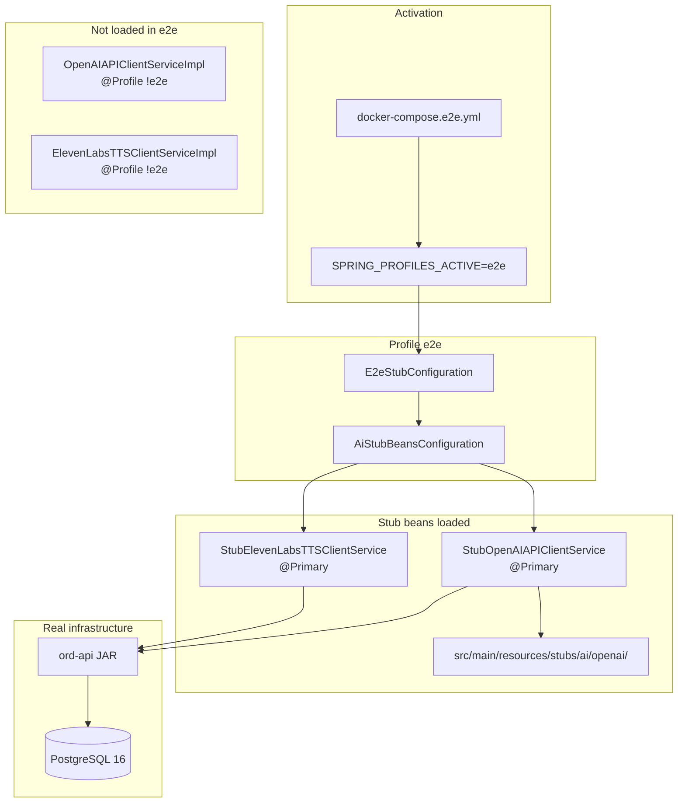
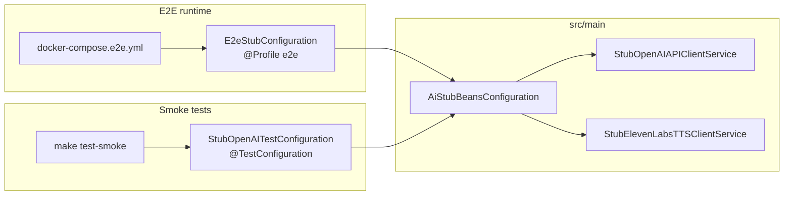

# E2E runtime profile (`e2e`)

Spring profile for running `ord-api` as a **Playwright E2E backend** — fixture-based external integrations, deterministic OTP, real PostgreSQL.

## When to use

| Context | Profile | OpenAI / ElevenLabs |
|---------|---------|---------------------|
| Local dev (real APIs) | `local` / default | LIVE HTTP clients |
| Heroku production | `production` | LIVE |
| Maven smoke tests | `test` + `StubOpenAITestConfiguration` | Stub beans (`@Primary`) |
| Maven integration tests | `test` + `INTEGRATION_TESTS=true` | LIVE |
| **Docker E2E / Playwright CI** | **`e2e`** | **Stub beans (no HTTP)** |

Activate:

```bash
export SPRING_PROFILES_ACTIVE=e2e
# or in docker-compose.e2e.yml (already set)
```

## Architecture



### Shared stub implementation

Smoke tests reuse the same beans — one implementation, two explicit `@Import` paths (never auto-scanned):



## Health check contract

`GET /api/v1/health-check` (no auth):

```json
{
  "application": "UP",
  "database": "UP",
  "ai": "STUB",
  "tts": "STUB"
}
```

In non-`e2e` profiles, `ai` and `tts` are `"LIVE"`.

Docker E2E healthcheck asserts `database: UP` and `ai: STUB`.

## OTP (deterministic auth)

Configured via environment (see `docker-compose.e2e.yml`):

| Variable | Value |
|----------|-------|
| `OTP_WHITELISTED_EMAILS` | `e2e-ci@ord.test` |
| `OTP_CODE_FOR_WHITELISTED_EMAILS` | `123456` |

Matches `ord-frontend` `.env.e2e.example` / CI workflow.

## Adding AI fixtures

Same process as smoke tests — see [`smoke-tests-with-ai-stubs.md`](./smoke-tests-with-ai-stubs.md).

Fixtures path: `src/main/resources/stubs/ai/openai/<domain>/`.

Registry: `src/main/kotlin/com/ord/stubs/ai/AIFixtureRegistry.kt`.

## Related files

| File | Role |
|------|------|
| `src/main/resources/application-e2e.properties` | Profile defaults |
| `src/main/kotlin/com/ord/config/e2e/E2eStubConfiguration.kt` | Profile entry point |
| `src/main/kotlin/com/ord/config/e2e/AiStubBeansConfiguration.kt` | Shared stub beans |
| `docker-compose.e2e.yml` | CI/local E2E stack |
| `openapi.json` | `HealthCheckResponse`, `AiIntegrationMode` schemas |
